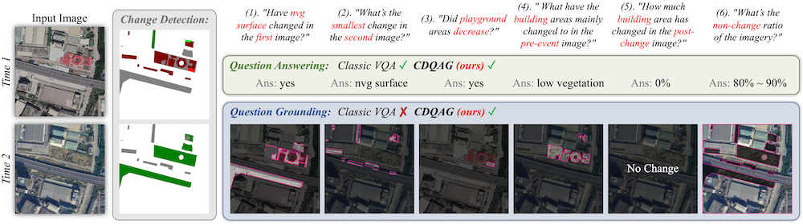
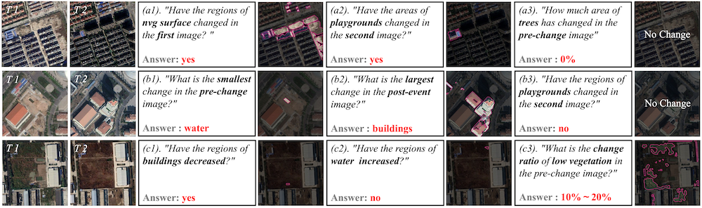
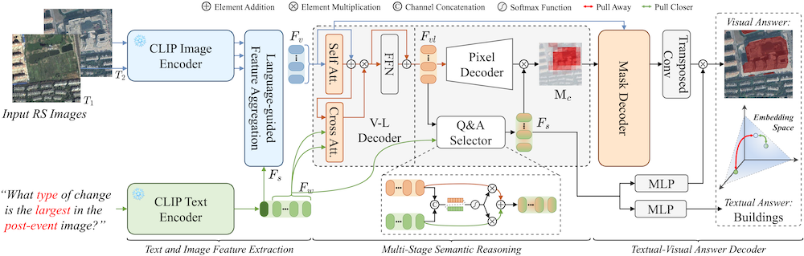

# This repository is the official implementation of "Show Me What and Where has Changed? Question Answering and Grounding for Remote Sensing Change Detection"

Our QAG-360K dataset: [Remove to avoid violating double-blind]()
The repository only contains a demo subset to illustrate the dataset structure.

## 👋 Task CDQAG
CDQAG takes a pair of remote sensing images and a question as input. The output is a textual answer and a corresponding visual segmentation. Unlike classic VQA methods that provide only natural language responses, CDQAG can offer both textual answers and correlative visual explanations, which is critical for reasonable remote sensing interpretation.

    

## 🔥 Benchmark dataset QAG-360K
To comply with the ICCV double-blind policy, only dataset samples are provided in the supplementary material.

    

## 🌟 Simple Baseline Model VisTA
The code can also be found in the supplementary material.

  

## 🙏 Acknowledgement
The dataset is based on [HiUCD](https://github.com/Daisy-7/Hi-UCD-S), [SECOND](https://captain-whu.github.io/SCD/), [LEVIR-CD](https://chenhao.in/LEVIR/), and [CDVQA](https://github.com/YZHJessica/CDVQA).
The code is based on [CRIS](https://github.com/DerrickWang005/CRIS.pytorch). We thank the authors for their open-sourced datasets and codes and encourage users to cite their works when applicable.
